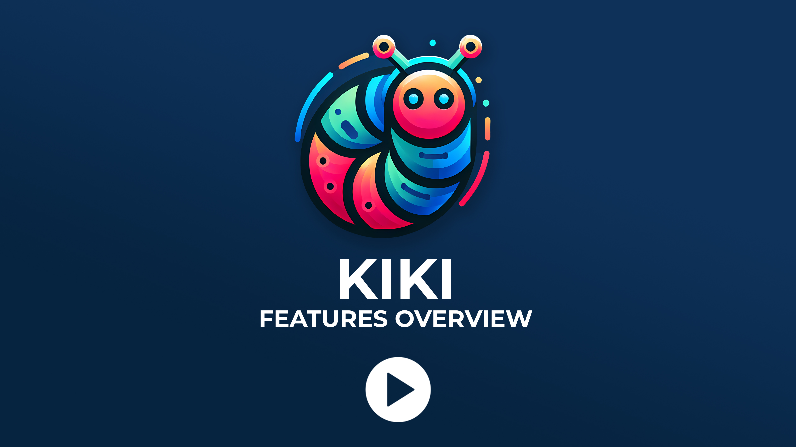
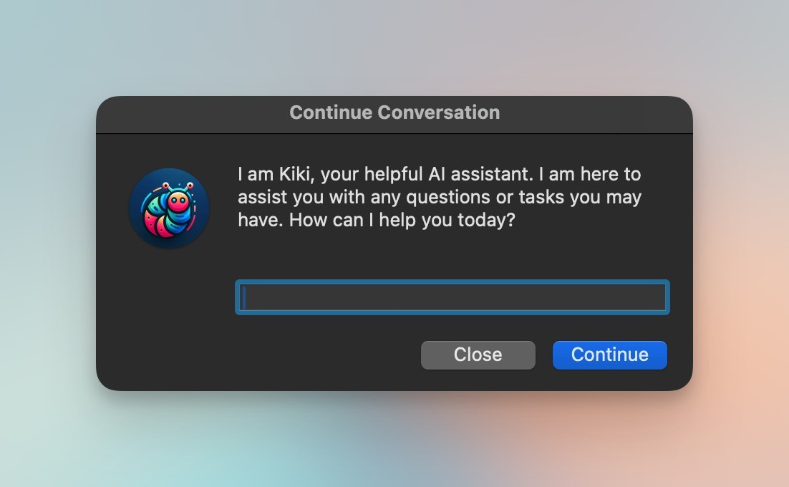
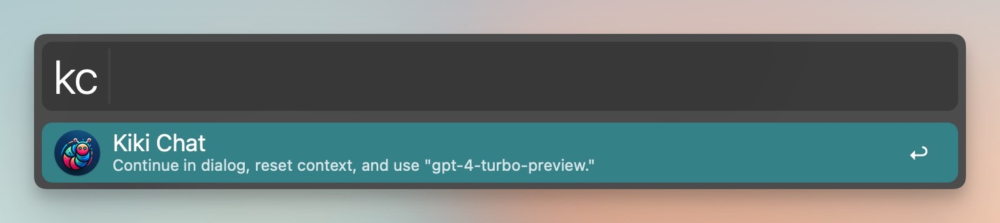
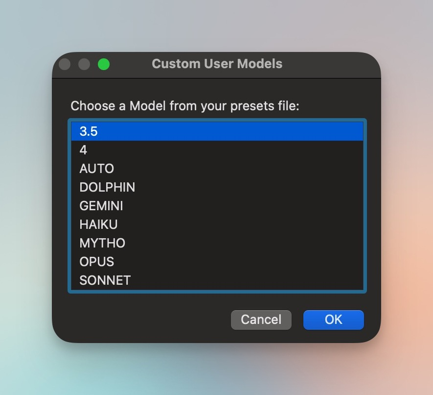
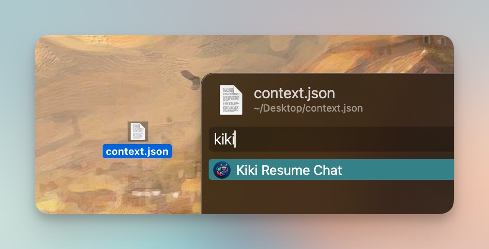
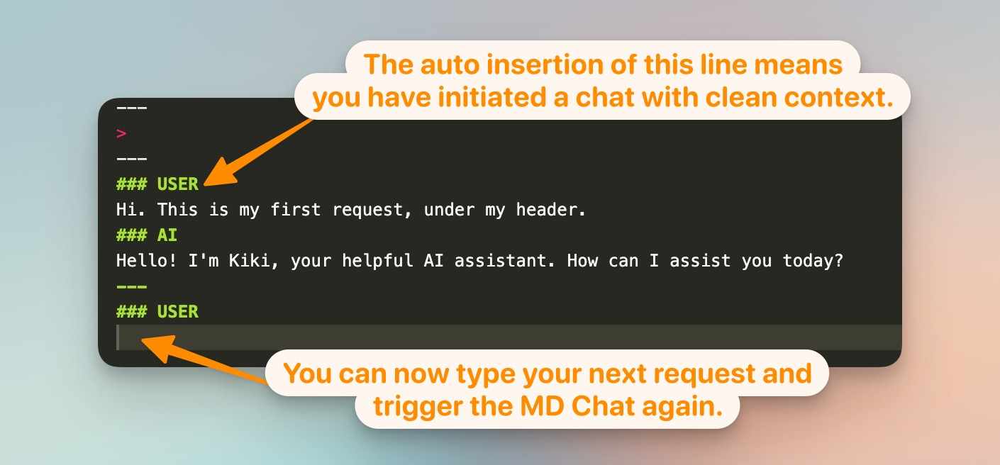
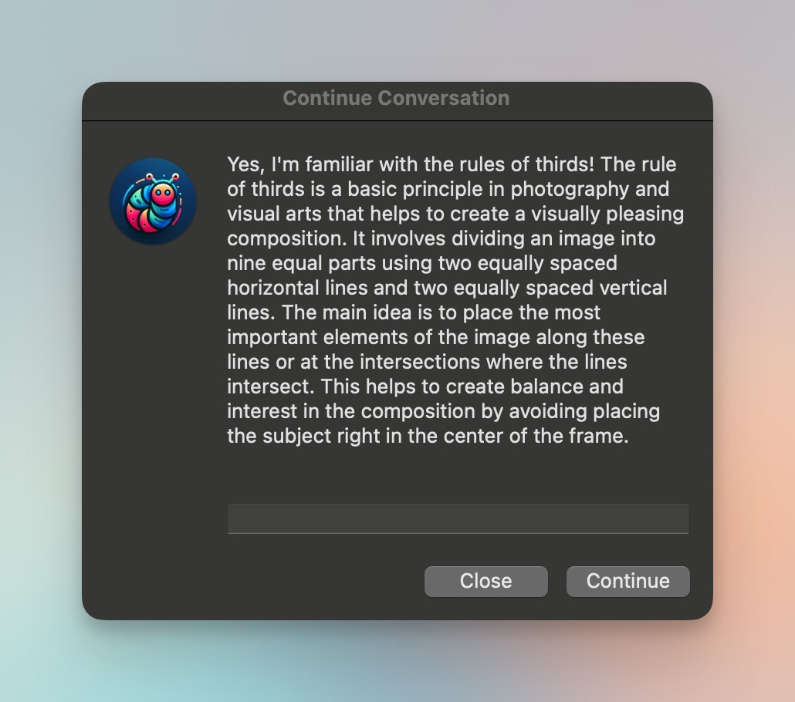
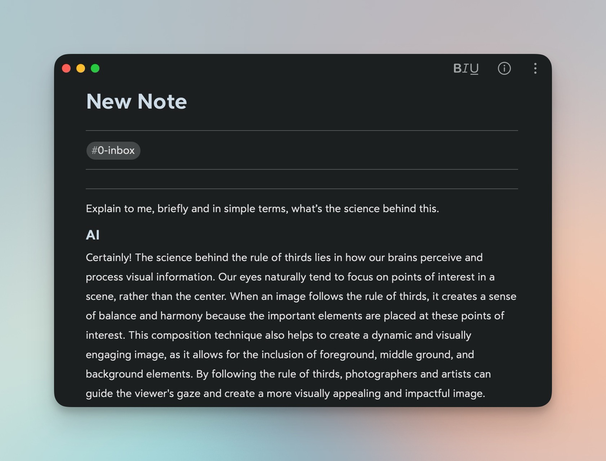

<h1 align="center">Kiki</h1>

<strong>AI-Powered Chat & Text Tools</strong>

    

<em><a href="https://youtu.be/nbYF9pyQyqc">Setup & Walkthrough</a> | <a href="https://youtu.be/mOc77fnzNPM">Whisper Features</a></em>

---

## TABLE OF CONTENTS
- [INTRODUCTION](#introduction)
- [REQUIREMENTS](#requirements)
- [SETUP](#setup)
- [ONLINE \& OFFLINE MODES](#online--offline-modes)
  - [ONLINE](#online)
  - [OFFLINE](#offline)
  - [ONLINE & OFFLINE](#online--offline)
- [HOW TO](#how-to)
- [BASIC](#basic)
  - [Keywords](#keywords)
  - [Tips](#tips)
  - [Modifiers](#modifiers)
  - [Universal Actions on Text](#universal-actions-on-text)
  - [Custom Triggers](#custom-triggers)
- [INTERMEDIATE](#intermediate)
  - [Custom Presets](#custom-presets)
  - [Resuming Chats from Context Files](#resuming-chats-from-context-files)
- [ADVANCED](#advanced)
  - [Markdown Chat](#markdown-chat)
  - [Markdown Chat Presets](#markdown-chat-presets)
  - [Resume Chats from within a Markdown Chat](#resume-chats-from-within-a-markdown-chat)
- [FOR AUTOMATION NINJAS](#for-automation-ninjas)
  - [The All-in-One Trigger](#the-all-in-one-trigger)
  - [Preset-Specific Triggers](#preset-specific-triggers)
  - [My Karabiner Setup for Kiki](#my-karabiner-setup-for-kiki)
- [FAQ \& LIMITATIONS](#faq--limitations)
- [CLOSING](#closing)

---

## INTRODUCTION
Kiki is an AI utility to interact with OpenAI Chat GPT, OpenRouter, and Anthropic LLM models. It now also supports a custom API endpoint, which allows it to interact with local/offline LLM models. It is specifically designed with the following features in mind:

1. **Quick chats initiated from Alfred’s command bar:** These chats start in the command bar of Alfred and continue as AppleScript dialogs.

2. **Create and use presets for selected text or user input:** Customize prompts, system role, temperature, and other settings. This feature can help with grammar correction, translations, rephrasing, tone adjustment, smart text transformations, idea generation, and much more.

3. **Chat initiation options with the use of modifiers from Alfred’s command bar:** These options include selecting an alternative model, an alternative system role or "persona," pasting results in the frontmost window, and preserving or resetting existing context.

4. **Easy continuation of previous conversations:** Seamlessly continue previous conversations by using Alfred Universal actions on existing context files.

5. **Trigger presets on text using hotkeys, snippets, or external triggers:** Activate presets on text using hotkeys, snippets, or external triggers for faster results, without needing to use Alfred's command bar.

6. **Markdown Chat:** Enjoy the convenience of making AI requests directly in your preferred markdown text editor. Customize the chat settings through presets included on the header of your notes according to your preferences.

7.  **Whisper AI Transcriptions:** Convenient multi-language transcriptions right at your fingertips. You can dictate/transcribe and paste in frontmost app, dictate and run the transcription through a custom preset, or transcribe any audio file below 25 MB with Alfred's file action.

  

---
## REQUIREMENTS
* [OpenAI](https://openai.com/api/) and/or [OpenRouter](https://openrouter.ai/) and/or [Anthropic](https://www.anthropic.com/api) API Tokens with existing credits or payment setup. || Alternatively, users can set a custom API Endpoint URL.
* [Jq](https://formulae.brew.sh/formula/jq)

**OPTIONAL.** 
* To utilize the Markdown Chat feature, ensure that your text editor copies selected text as markdown, rather than as formatted rich text.
* To be able to record and transcribe audio, you need to have [THIS SHORTCUT](https://www.icloud.com/shortcuts/c2154f998e664884b80d08a0a77f397c). It's just a simple recorder. Whisper AI requires an OpenAI API Token with credits.

*Note: ‘Jq’ is necessary for Kiki to correctly format AI requests. In Terminal, simply run `brew install jq`. If you do not have [Homebrew](https://brew.sh/) in your system, you may need to install that first in order to install ‘jq’.*

---
## SETUP

**The workflow’s configuration was prepared so that you:**
1. Enter either an OpenRouter/Anthropic/OpenAI/GROQ API Token AND/OR a custom API Endpoint URL.
2. Make sure to set your default Model to one you have access to.
3. Select your preferred Kiki data directory.
4. You’re all set! You can now begin using Kiki.

**To make the most of this workflow, consider setting up the following as well:**
1. **An alternative model.** Your alternative model can be the same as the default.
2. **An alternative system role.** This allows you to quickly send chats or requests to an alternative AI "persona."
3. **The path to copy context files to.** While Kiki is optimized for one-time interactions, having a designated path to copy your context files enables you to easily keep track of multiple conversations that can be resumed at any time.
4. **MD Chat Pattern ID.** If you use a text editor that supports Markdown, you may need to change this to another character. For example, I use [Bear](https://bear.app/), which supports organization through tags, so my Pattern ID is "#". The purpose of this setting will become clearer as you read through this documentation.

All the other options allow you to further customize Kiki according to your personal needs. However, the default settings should suffice for most use cases. If you ever need to reconfigure the workflow, simply right-click on the workflow's name in Alfred and select "Configure...".

*NOTE: The Frequency Penalty and Presence Penalty parameters are not available through the Anthropic's API. Any values you insert for those parameters in your Kiki workflow will be ignored. Other than that, it works the same as OpenRouter and OpenAI models.*

---
## ONLINE & OFFLINE MODES

Setting up Kiki can be done in three ways: Online, Offline, or both Online & Offline.

### ONLINE
* **Simply use API Tokens from the online services you have credits on.** Make sure to use models your account currently has access to.

### OFFLINE
* **To use Kiki locally without any online service, leave the API Token fields blank and fill in the API Endpoint URL.** The API Endpoint URL must be compatible with OpenAI's API for Kiki to function properly. It typically looks like: `http://127.0.0.1:11434/v1/chat/completions`. _Check the documentation of the specific tool you are using. Ollama and LM Studio have been tested without issues._
* The "model" parameter may or may not be necessary based on your API Endpoint URL. 
  * *For example, if LM Studio only loads one model in its server, the model parameter is ignored. However, if there's a Multi Model session, the server requires the model identifier. Ollama always requires the model parameter.*

### ONLINE & OFFLINE
* You can use both online and offline models interchangeably in Kiki. **For requests to be directed to the custom API Endpoint URL, add "custom\_" as a prefix to the offline model you want to use.** Online services (OpenAI, OpenRouter, Anthropic, Groq) are auto-recognized and do not require a prefix.
  * *For example: If using Ollama with model "llama2", write "custom\_llama2" in your workflow configuration. The same naming convention should be followed when setting up models within presets.*
* In case of using an API Endpoint URL where the "model" parameter is not required, Kiki still needs the "custom_" prefix as an identifier for such a model. *This is only a requirement when you have at least one API token configured for an online service. It won't make a difference if all the API Token fields are left blank.* 

---
## HOW TO
Kiki is powerful, flexible, and offers extensive customization options. It’s easy to get lost with everything it can do. To simplify this guide, I will categorize its features and modes of use into basic, intermediate, and advanced levels. If you find that the basic level meets your requirements, there's no need to feel overwhelmed by all the additional options. 

---
## BASIC
### Keywords
* **The "kc" (or Kiki chat) keyword allows you to start a chat session.** Simply type the keyword followed by a space, and you can begin typing your message.

  

* **The "ko" (or Kiki options) keyword provides a menu of actions you can perform on your Kiki data files.** This menu will automatically populate after you have engaged in at least one chat. Press and hold the CMD key while selecting file-related options to reveal your data directory. Additionally, you can tap the SHIFT key (or CMD Y) to quickly preview the file associated with the selected action.

*NOTE: Whisper AI Transcription offers different options with the CMD, OPT, and SHIFT modifiers. You may also "Resume Last Chat" with CMD to use your alternative set model or FN + SHIFT to use a model from your presets/models.json file.*

  

* **The "kt" (or Kiki text) keyword presents you with text presets.** Once you choose a preset, you can enter the text you want to use. Kiki comes with a few basic presets, but we will explore how to create custom presets in the [INTERMEDIATE](#intermediate) section of this guide.

  

---
### Tips
* In a chat, text preset, or even in the popup dialogs, you can **use the contents of your clipboard with the placeholder** set during configuration.
* Alfred's command bar does not support multi-line input (it does support multi-line pasting). However, **if you need to enter a line break in your chat through dialogs, press OPT + RETURN.**
* When you have initiated a chat through dialogs, you can press escape to close. **Press continue or return with an empty reply to quickly copy the last response received.** 
* Accidentally closed a dialog? **You can resume your last chat** either from the Kiki options menu, or by pressing and holding CTRL when initiating a chat with the "kc" keyword.
* For a convenient way to initiate a simple and quick chat, **you can add Kiki as a fallback search within Alfred.** This allows you to start a chat without the need to type a keyword. To setup Kiki as a Fallback search in Alfred go to Features > Default Results > Setup fallback results (all the way to the bottom). Look for workflow trigger. Keep in mind that using this method means you won't have access to modifier options. 

---
### Modifiers
When using Kiki, you can have more options in your interactions by holding down different modifiers while initiating a chat or preset from Alfred's command bar. Here's a simple breakdown of what each modifier does:

  

- **CMD:** This allows you to use an alternative model and, if configured, an alternative system role.
- **OPT:** By holding OPT, you can paste the response directly into your frontmost window instead of displaying it in a dialog.
- **CTRL:** When using CTRL, the existing context file will not be reset. Keep in mind that if the number of existing messages in the file exceeds the threshold set in the workflow's configuration, the oldest message will be removed.
- **SHIFT:** This modifier triggers Kiki to reply in a dialog. It is the default way Kiki answers chats or presets initiated from Alfred's command bar. As we will learn soon, this "default" may change.
- **FN:** Holding FN allows you to get Kiki's answer below your selected text. This option is only available when using Kiki on selected text through a universal action, hotkey, snippet, or external trigger.
- **FN + SHIFT:** This allows you to send your request to ANY of the preset models configured in the presets/models.json file inside Kiki's data folder. **IMPORTANT: You do have to rename your presets folder or it to be discoverable and have configured some models for this to work. More in the [INTERMEDIATE](#intermediate) section of this guide.**

  

---
### Universal Actions on Text
Select text and trigger your hotkey for Alfred's Universal Actions. Search for "Kiki" to be presented with some options for what to do with the selected text. In this mode, Kiki will automatically paste the result. If you want to customize this behavior, you can do so using modifiers once Alfred's command bar appears, as explained above. 

  

*NOTE: the "Send to Chat" option won't present you with Alfred's bar, essentially being the only action that will always replace your selected text. You can now also trigger Universal Actions on txt or markdown files. In this case the result will appear as a dialog.*

---
### Custom Triggers
Kiki provides various options for triggering chats, presets, actions, or menus, in addition to using Alfred keywords. You can zoom out with CMD & “-“ in the workflow editor to see them clearly. These options are color-coded as follows:
* **Yellow-colored hotkeys** are the most basic and perform the same actions as the Kiki keywords.
* **Green-colored hotkey**s work on selected text, serving as shortcuts to the options available as Universal Actions.
* **Orange-colored snippets** simulate the "CTRL + SHIFT + A" OR "OPT + SHIFT + UP" keyboard shortcut to select text up to the previous line break. **IMPORTANT: while most text editing apps receive and interpret the OPT shortcut, it does not work everywhere, that is why Kiki gives you the option to set this up as you prefer in the configuration. It’s a good idea to test first and choose the option that will be compatible with the app you plan to use snippets most.** The snippets in Kiki will send the selected text to one of the options available as Universal Actions. **With snippets, along with the same options found in Universal Actions, you can also directly process text presets and automatically paste the results.** It’s a fantastic way to use Kiki inline, without loosing focus on what you are typing. More information about this and how to create your own can be found in the Advanced section.
* **Blue-colored triggers** offer powerful ways to communicate with Kiki from outside the workflow or from within third-party apps. More information about this in the Advanced section.
* **Violet-colored triggers** are used for the Markdown Chat feature. It is recommended to avoid setting these up or using them until you understand how this feature works.

---
## INTERMEDIATE
### Custom Presets
The chat feature is quick and convenient, but you can save even more time by using text presets for performing common tasks or initiating chats with a specific prompt. Kiki is designed to be customizable, allowing every user to create their own presets. Each preset can have their own model, system role, and other settings, but for now let’s take a look at the most basic:
1. **Go to the directory where Kiki's data is located.** You should see a folder named "presets_" there. If you don't, go back to Kiki's configuration and make sure you have selected the "Create Presets Folder" option. The folder will be created after a quick chat interaction with Kiki.
2. **Remove the underscore from the folder name, so it becomes "presets".** This will allow Kiki to read your presets.
3. **Preset files are in JSON format.** The file used for text presets in Kiki is text.json. There are two additional files (models and systems) for the Markdown Chat feature, which we will cover later. You can open JSON files with any text editor, such as TextEdit. Let's take a look at the text.json file.
4. **If you've never edited a JSON file before, don't worry. It's straightforward. There are three keys that require a value for each of your text presets: id, theTitle, and thePrompt.** Make sure to keep everything in the correct form, within double quotes, a comma at the end of each line (except the last one), and a colon between the key name and its value. If you add another preset, don't forget to add a comma after the closing curly bracket, just like there is one between the two presets already included.
5. **JSON is very flexible with special characters,** but if you want to include a `"` quotation mark in your prompts, you need to escape it by adding a `\` before it. It's best to avoid using slashes `/` and backslashes `\` in your prompts unless you are familiar with their specific usage in JSON format. For instance, I use `\n` to indicate a line break. Additionally, keep in mind that the placeholder `[[txt]]` will be replaced with your actual input when using your preset.
6. **If you're unsure about your formatting or if a preset isn't appearing in your list, you can ask Kiki to fix any JSON formatting issues for you 😀️**. 

*Note: We will talk more settings for presets in the advanced section, when we talk about presets for Markdown chat.*

---
### Resuming Chats from Context Files

**Kiki is designed to handle one chat at a time.** It is also designed to only store previous conversations temporarily. When you start a new chat, the previous context file is replaced, unless you specify otherwise. However, you can still pause a chat and resume it later, allowing for multiple conversations.

For example, let's say you're chatting with Kiki and you need to pause to perform a different request. You can create a copy of the context file to continue the chat later. Or, if you're working on multiple projects with Kiki's assistance, you can save the context file before taking a break. This way, you won't lose any progress when you come back to it.

Resuming chats from context files becomes even more convenient when using Markdown Chat. Many markdown text editors allow you to attach files, so you can keep your chat along with its current context file.

Here are a few things to keep in mind:
- **To create a copy of the latest context file you can do so from the "Kiki Options" keyword menu.** Make sure you have set up a path for the copy in the workflow configuration.
- **If you're looking for a previous conversation, you can find it in your history directory.**  The number of items in your history folder is set in the workflow configuration, and the files are sorted by date and time.
- **If you want to modify a context file before resuming a chat, you can do so in your text editor.** This allows you to improve the quality of the responses you'll receive. Just remember that the last message in the context file must be from the "assistant" in order to be able to resume the chat.
- **To resume a chat from a context file, select the context file and trigger the hotkey you have set for Alfred Universal Actions.** Search for Kiki.
- **When you resume chats, Kiki will use dialog popups by default and will not auto-save the conversation to your context file copy.** It will continue to save to its data folder. However, you have some options you can trigger by holding modifiers:
  - CMD to resume the chat using your alternative model.
  - FN + SHIFT to resume the chat using a model from your presets list (set in models.json).
  - CTRL to continue auto-saving the conversation to your context file.
  - OPT to resume your chat from within the Markdown Chat feature. Do not use this modifier until you learn how this feature works.

  

*Note: When you resume chats using Alfred's Universal Action, your previous messages and system role will be retained, but all other settings will be based on Kiki's default configuration. You can select a model with the FN + SHIFT modifiers, but for maximum flexibility, it is recommended to use the Markdown Chat feature.*

---
## ADVANCED
### Markdown Chat
The Markdown Chat feature allows you to have conversations with Kiki using your favorite markdown text editor. You can specify conversation settings in the header of your note. It's important to note that this feature uses Copy + Paste through AppleScript since Alfred doesn't have a direct way to read or input text in your host app. Consider this an experimental feature, as AppleScript GUI automation may sometimes present some errors.

**How does this work?**
When you trigger the Markdown Chat feature in Kiki, it automatically selects the entire text in your note and extracts the user request based on a text pattern. After identifying the request, Kiki submits it to the AI and appends the result below the user's text. This creates a formatted area for continuing the conversation. You can write another request and trigger Kiki again to continue the conversation.

**Important**
Your text editor doesn't need to interpret markdown, but it's preferable for a better visual experience. Do make sure that your host application doesn't copy rich text or changes the format when copying. For example, [Bear](https://bear.app/), my favorite note-taking app, is great for this. [Day One](https://dayoneapp.com/), even though it supports markdown, messes with the formatting when copying text. 

**The Trigger**
There are three ways to trigger a Markdown Chat request. Remember these are color-coded in violet within the workflow:
1. **Snippet trigger:** Recommended for first-time users. Set it up to be easy to remember but not easy to trigger accidentally.
2. **External trigger:** My preferred method to interact with Kiki.
3. **Hotkey trigger:** Select all the text in your note manually and then press the hotkey to send it to Kiki. This method is less convenient but serves as an alternative if you prefer to skip using AppleScript to trigger the initial selection and copy.

**Correct Formatting**
Before triggering your Markdown Chat, let's look at how you should format your note for it to work properly. 

  

If your Mac automatically joins the hyphens when typing them as in the image, you can work around this by adding a space between them, like `- - -`, or by using three asterisks `***`. Your markdown text editor should still recognize these as line separators. Once you initiate the Markdown Chat, **Kiki will automatically add the "USER" heading text to indicate that the context has been reset.**

  

  

*My recommendation is that you either setup your notes you start with the header already there, or that you create a snippet within Alfred to insert the header for you.* 

**To make the most of the Markdown Chat feature, it's important to understand how Kiki prioritizes different formatting within your text:**
1. **CONTINUE CHAT:** To continue an ongoing conversation **WITH EXISTING CONTEXT**, use the pattern `---<line break>### USER<line break>` . As you can see from the images above, this is automatically inserted by Kiki once you initiate a chat. Only if this pattern doesn't exist, Kiki will move on to the next option.
2. **CONTINUE ANYWHERE:** Trigger a Markdown Chat and include everything below the last double line separators `---<linebreak>---<linebreak>`. This will be sent as your request **WITH EXISTING CONTEXT**. Only if there's no “USER” header and no double line separators, Kiki will move on to the next option.
3. **INITIATE A CHAT WITH A FORMATTED NOTE HEADER:** If none of the previous patterns is recognized, Kiki will look for a formatted note header—as explained above—followed by a request (WITHOUT the “USER” header). If found, it will initiate a conversation **RESETTING CONTEXT**.
4. **CONTINUE ANYWHERE WITHOUT FORMATTING:** In cases where there is no USER header, no double line separators, and no note header, Kiki will send your entire text as an AI request. This option will also retain any existing context (as long as it’s within the user’s set limit in the configuration).

Knowing this, you can start a conversation from within Alfred’s command bar where you get the response in a dialog…

  

And simply continue with a Markdown Chat in a completely blank note, or after inserting a double line separator.

  

But there’s more! You can use presets to configure the settings in which the Markdown Chat will prepare your AI Request. 

### Markdown Chat Presets
Kiki will recognize presets or commands for your conversation within the header of your note. These will override the default settings in Kiki's workflow. **To trigger these presets and commands, they must be preceded by a whitespace and include the correct identifier.** Here are the available options:
* M_<id>: sets the model to be used. Models are read from the models.json file in your presets folder. The model ID must include "M_".
* S_<id>: sets the system role or persona to be used. You can define your own system roles in the systems.json file in your presets folder. The system ID must include "S_".
* C_<number>: sets the context of your conversation. Use 0 for unlimited context.
* T_<number>: sets the temperature. The value must be between 0 and 1.
* X_<number>: sets the maximum number of tokens.
* F_<number>: sets the frequency penalty. The value must be between -2 and 2.
* P_<number>: sets the presence penalty. The value must be between -2 and 2.
* O_<number>: sets the top P value. The value must be between 0 and 1.

For example, I used this a lot during the creation of Kiki:

  

Oh, and remember when we talked about custom text presets? You can also use most of these parameters there! 

  

*Note: Notice that you cannot directly set the context limit as a parameter when creating text presets. Instead, you need to define this within the workflow configuration. You can always override this setting when triggering a text preset by holding down the CTRL key, or by using the parameter specified in the header of a Markdown Chat.*

### Resume Chats from within a Markdown Chat
If your markdown text editor allows you to include media and files on your notes, you can use Alfred's Universal Actions to trigger "Kiki Resume Chat" on an attached context file. To resume your chat within your Markdown Chat instead of a dialog, hold the OPT modifier key while selecting the option. Kiki will then read the conversation settings from your note header.

  

*Note: As a helpful tip, you can save time by setting your most frequently used header parameter combinations as Alfred snippets.*

---
## FOR AUTOMATION NINJAS
In Kiki, there is a feature that can greatly enhance efficiency and productivity for users who want to make the most out of their system. This feature involves external triggers, which can be activated using AppleScript or Alfred's URL handler. By utilizing these triggers, you can access almost all of Kiki's functions from other third-party apps that can run Applescripts or even from other workflows.

The simplest external triggers in Kiki are "kikiWorkflow" and "kikiChat". These triggers do not require any arguments and will open the main Kiki Options or Kiki Chat respectively. There’s also "kikiMD", which is used to trigger a Markdown Chat. If you navigate to the far right in the workflow editor, you will find the external trigger "kikiFiles". By sending one of the following arguments to this trigger, you can bypass the Kiki Options menu and directly perform specific actions:

  

- filesCopyResponse: This will copy the latest response from Kiki to your clipboard.
- filesCopyContext: This will copy the current context file to your specified path.
- filesResetLogs: This action clears your Kiki data without deleting your presets.
- filesOpenContext: This will open your current context file in your system's default JSON file editor.
- filesRevealPath: This will reveal your Kiki data directory in Finder.

---
### The All-in-One Trigger
There is one external trigger which can replace a lot of your hotkeys, universal action triggers, snippet triggers, and it can even replace the use of Alfred’s command bar for text presets. This is the “kikiActions” trigger.

  

**The All-in-One Trigger in Kiki receives four arguments, which should be entered without spaces and separated by commas.** Let's break down what each argument means:

1. **The first argument can be either "menu" or "direct."** This determines whether the user will be directed to the Kiki Text Presets menu or if a specific preset will be processed directly.
2. **The second argument can be "copy," "snippet," "incoming," "whisper," or "custom."** 
   - If "copy" is chosen, it assumes that the user has selected text and wants to run it through the text presets menu or process it with a preset. If you use “copy” and there’s no text selected, Kiki will use whatever there is already in your clipboard 😉.
   - Using "snippet" triggers the CTRL + SHIFT + A shortcut, which selects text up to the previous line break. The selected text is then run through the text presets menu or directly processed with a preset.
   - If the second argument is defined as "incoming," Kiki will grab the user's current clipboard content and will use it as the input for the workflow. This option is particularly useful for users to create their own Universal Actions to directly trigger their own custom presets—since Alfred's Universal Actions place whatever text is selected on user's clipboard.
   - The "whisper" argument will prompt the user to record audio and Kiki will use its transcription as the input for the workflow.
   - Choosing "custom" means that no input is required initially. The user will be presented with Alfred's command bar to type an input something for either the text presets menu or an already-selected preset.
3. **The third argument must be a number from the list of modifiers below.** This argument simulates a modifier or modifier combinations within Alfred's command bar. By using this, you can skip the command bar entirely and still have control over the multiple processing options available with Kiki.
4. **The fourth argument refers is the ID of your text preset.** This argument is optional and must only be included if the first argument is "direct.”

*NOTE: For Whisper AI, there's a few unlisted options. If kikiActions is run with "paste,whisper" then the user will be prompted to record, and the result will be pasted to the frontmost app. If kikiActions is run with "customWhisperPrompt" as its fourth argument, the user will be prompted to record audio and this will be transcribed to be used as the custom prompt of the workflow's input (which should be set by the other arguments). For example, user may select text and trigger kikiActions with "direct,copy,1,customWhisperPrompt". Lastly, the kikiActions trigger can receive fifth argument when used for Whisper transcriptions. This fifth argument can be the path or multiple paths tab-separated to audio files for them to be transcribed. For example "direct,whisper,1,translate,path1	path2*

**Number codes to be used on the third argument:**
1. **No Modifiers.** Continue in dialog, reset context, and use the main chat model.
2. **Command.** Continue in dialog, reset context, and use the alternative chat model.
3. **Control.** Continue in dialog, do not reset context, and use the main chat model.
4. **Option.** Paste in frontmost app, reset context, and use the main chat model.
5. **Shift.** Continue in dialog, reset context, and use the main chat model.
6. **FN.** Insert Below, reset context, and use the main chat model.
7. **Command + Control.** Continue in dialog, do not reset context, and use the alternative chat model.
8. **Command + Option.** Paste in frontmost app, reset context, and use the alternative chat model.
9. **Command + Shift.** Continue in dialog, reset context, and use the alternative chat model.
10. **Command + FN.** Insert below, reset context, and use the alternative chat model.
11. **Control + Option.** Paste in frontmost app, do not reset context, and use the main chat model.
12. **Control + Shift.** Continue in dialog, do not reset context, and use the main chat model.
13. **Control + FN.** Insert below, do not reset context, and use the main chat model.
14. **Command + Control + Option.** Paste in frontmost app, do not reset context, and use the alternative chat model.
15. **Command + Control + Shift.** Continue in dialog, do not reset context, and use the alternative chat model.
16. **Command + Control + FN.** Insert below, do not reset context, and use the alternative chat model.
17. **SHIFT + FN.** Continue in dialog, reset context, and choose a model from the preset list.
18. **SHIFT + FN + Option.** Paste in frontmost app, reset context, and choose a model from the preset list.
19. **SHIFT + FN + Control.** Continue in dialog, do not reset context, and choose a model from the preset list.
20. **SHIFT + FN + CMD.** Insert below, reset context, and choose a model from the preset list.
21. **SHIFT + FN + Control + Option.** Paste in frontmost app, do not reset context, and choose a model from the preset list.
22. **SHIFT + FN + Command + Control.** Insert below, do not reset context, and choose a model from the preset list.

---
### Preset-Specific Triggers
**To make it easier to understand how to use the "kikiActions" trigger, let's create a snippet that allows us to trigger one of our text presets from outside Kiki's workflow.** This is useful because if you add more snippets or hotkeys within Kiki, they may be replaced if there is an update for the workflow.
1. Open the Alfred workflow editor and click the "+" button in the bottom bar. Select "Blank Workflow" and give it a name. Click "Create."
2. Right-click on the blank canvas and select "Trigger," then choose "Snippet." Enter your keyword and save.
3. Go back to Kiki and double-click on the "kikiActions" external trigger. Copy all the text in the Sample Code area.
4. Return to your newly created workflow and right-click on the canvas. Select "Actions," then "Run Script." In the "Language" dropdown, choose the option with AppleScript.
5. Paste the code you copied into the Script area. Replace "text" with your desired arguments. For example, you can use "direct,snippet,4,emojify." "Emojify" is one of the text presets and snippets already included, but you can replace it with the ID of your custom preset.

  

6. By using these arguments, you are telling Kiki to skip the menu, directly grab the text from since the last line break, replace the selected text (as if using the modifiers from option 4), and run the text preset "emojify." If you want the result in a dialog instead of pasted in the frontmost window, you would use "direct,snippet,1,emojify" instead. 
7. Connect the snippet block to your script block, and now you have a preset-specific trigger! Test it in your text editor.

  

---
### My Karabiner Setup for Kiki
The "kikiActions" trigger provides endless possibilities when combined with custom text presets. To run Kiki, I personally use [Karabiner-Elements](https://karabiner-elements.pqrs.org/) the most. Karabiner is a powerful tool that allows you to remap and customize your keyboard, enabling you to trigger scripts, open apps, and more. I have set up a virtual layer on my keyboard specifically for Kiki where. If you're familiar with Karabiner and [Goku](https://github.com/yqrashawn/GokuRakuJoudo), you can refer to my EDN file configuration [here](https://github.com/afadingthought/dotfiles/blob/main/karabiner/karabiner.edn) (look for the Kiki AI layer). If you are not familiar with Karabiner but still want some inspiration, here's [a simple version.](https://github.com/afadingthought/dotfiles/blob/main/karabiner/keyboard-mods.md#a-mode-kiki-ai)

---
## FAQ & LIMITATIONS

**Is there any way to speed up Kiki’s responses?**
The speed of Kiki's responses depends on your Internet speed or the speed of the OpenAI/OpenRouter/Anhtropic servers. In my testing, I have found that Chat GPT 3.5 Turbo is the fastest model and I can only expect all the other models to eventually become faster.

**Is there any way to see the progress of my request? How do I know Kiki is not stuck or that my Internet connection went out?**
Unfortunately, I haven't been able to find a good solution to this problem due to my limited coding abilities. If you have any ideas, please [feel free to share them with me.](mailto:hello@afadingthought.com)

**What if my request times out? Is there any way to get a system notification?**
Currently, there is no implemented solution for this issue. However, in all of my testing, I haven't encountered any request timeouts with the way the workflow is set up. If you reach the max_token limit, the model is more likely to give you an incomplete response, or if something is not right, it will give you an error message instead of timing out. 

**Is there any way to make the waiting placeholder smaller?**
The waiting placeholder is useful to prevent clicking around while waiting for a response to be pasted in your frontmost app. Unfortunately, there are limited formatting options within Alfred to adjust its size. You can customize it to some extent in the "Large Type" block color coded in red, or you can disable it completely in Kiki's configuration.

**My response seems cut off… what happened?**
There are two things to consider here. If you find that your response is being cut off (on a short AppleScript Dialog), it is likely due to your Max Tokens setting. To avoid this issue, it is recommended to set the Max Tokens value to 0. If you have already set it to a different value, you can try increasing it. Additionally, there is a length limit for Kiki's dialogs... Kiki replies will be cut-off at about 1800 characters. If you are having a lengthy conversation with long answers and want to avoid hitting this limit, it is suggested to use the Markdown Chat feature.

**Why won't Kiki use Alfred's text view?**
I'd love to integrate Kiki with Alfred's text view. This just seems to require a major code rewrite and I haven't quite figured out how to do that while keeping the current feature set. I do hope to eventually get there, but any suggestions, ideas, or contributions are welcome.

**My snippet requests seem to send the text from my clipboard instead of the one indicated by my snippet.**
If this happens, first of all check that the keyboard shortcut for CTRL + SHIFT + A works by itself. It should select the text up to your previous linebreak, but if it's not happening it means your host app is not compatible with this feature. If the selection alone works and you have this issue it's likely due to the delay required for your system to copy text to the clipboard. You can change this setting in Kiki's configuration. A delay of 0.5 should work for most cases, but if you're experiencing this issue, you may need to increase it slightly. Conversely, you can lower the delay to make Kiki feel more responsive. I have my delay set at 0.3.

---
## CLOSING
I hope Kiki proves to be useful for you. If you come across any bugs that you can reproduce, please don't hesitate to [let me know.](https://github.com/afadingthought/kiki-ai-workflow/issues) I will do my best to address them.

The inspiration to create Kiki came from ToolVox AI. If you know about Shortcuts and would like a similar custom AI presets tool for iOS, you can check it out [HERE](https://afadingthought.substack.com/p/toolvox-gpt-one-shortcut-to-rule). ToolVox AI offers a few more features than Kiki, such as web browsing, GPT4 Vision, Eleven Labs integration, and Dall-e 3. Kiki was designed as a simpler alternative for everyday tasks.

*Lastly, if you find Kiki useful, I would greatly appreciate your support by buying me a coffee at [THIS LINK](https://www.buymeacoffee.com/afadingthought). Your generosity would mean the world to me. For any future updates on Kiki or other personal projects, you can sign up for my newsletter: [A Fading Thought](https://afadingthought.substack.com/)*
